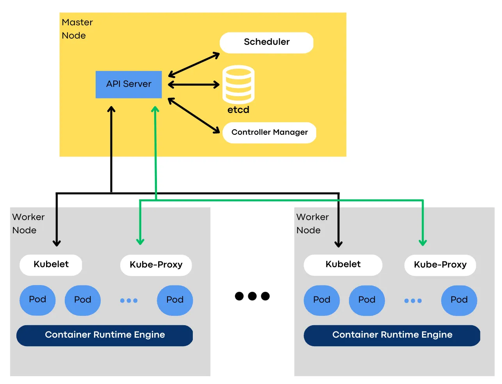

# Control Plane
Master nodes that manage the cluster
Manages the state of the cluster
Monitor and manages system objects

## API Server 
Central control point\
Exposes Kubernetes API for external interactions - Create, update, delete and so on \
Validate and process requests above mentioned\
Communicates with other components to maintain the desired state

## Scheduler
Responsible to place the pods onto worker nodes\
Ensures that pods are scheduled to run on the appropriate nodes taking into account factors such as available resources, affinity and anti affinity rules\
Continuously monitor the state of the cluster and make decisions about where to place new pods based on the current state and the desired state of the cluster\

## etcd
distributed key-value store that is used to store the configuration data of the cluster\
Reliable and consistent way to store and retrieve data\
User by the API server to store information about the state of the cluster\
Designed to be high available and fault tolerant
replicated across all nodes

## Controller Manager
Responsible for maintaining the desired state of the cluster and take actions to ensure the desired state is maintained, types of controller:\
  - Replica set controller - ensures that the specified number of replicas of the pods are running
  - Node Controller - monitors the health of the worker nodes and take actions if a node becomes unavailable
User the API server to communicate with other components of the control plane and with the API server to ensure that the desired state of the cluster is maintained

# User Plane
Worker nodes are responsible to run the containers

## Pods
the smallest unit of deployment and the basic building block for running containerised applications. \
A pod is a logical host for one or more containers and is created and managed by Kubernetes\
Has its own unique IP address, but shares the same network namespace, which means that all containers in the pod share the same network interface and can communicate with each other using the loopback address.\
Pods can also share storage volumes, which makes it easier to manage data and access it from different containers within the pod. 

## Container Runtime Engine
Software component that is responsible for running and managing containers on the host system, example:
  - docker
  - containerd
  - CRI-O

These engines provide a variety of features and functionalities such as:
  - Image management
  - Container networking
  - Integration with orchestration platforms

## Kubelet
Running as an agent on each worker node and responsible for managing the containers on their host\
Communicates with API server to receive instructions  on which containers to run and how to run them\
Monitors the status of the pods running on the worker nodes and reports the information back to the control plane

## Kube-Proxy
Component of Kubernetes networking stack that runs on each worker node\
Main responsibility to handle network traffic to and from the pods running on that node - setting routing rules - Traffic Police

---

# Deployment process example:
1. The Developer creates a YAML (kubernetes deployment) file that specifies how the application should be deployed the including details such as container image, number of replicas, environment variables and volumes
2. The Developer uses kubectl command (API Server) to send the deployment configuration file to the Kubernetes API Server running on the master nodes
3. The API Server stores the deployment configurations in etcd, the distributed key value store used to to store cluster configuration data
4. The controller manager detects the new deployment and spawns a replica set controller to ensure the desired state of number of replicas of the application are running 
5. The scheduler schedules the pods for the deployment to run the appropriate worker nodes based on the resource availability and other constraints
6. The API server communicates with the worker nodes to initiate the deployment of the application pods